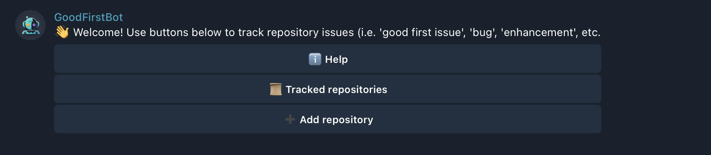

# Good First Bot

A Telegram bot for tracking beginner-friendly GitHub issues. The bot allows
users to easily add, remove, and list repositories they want to track, and it
periodically polls GitHub to notify users of new issues labeled as “good first
issue”, “beginner-friendly”, or “help wanted.”



## Features

- **Track GitHub Repositories:**  
  Add or remove repositories to receive notifications for new beginner-friendly
  issues.

- **GitHub Integration:**  
  Uses the GitHub GraphQL API to verify repository existence and fetch issues
  with specific labels. 

- **Telegram Bot Commands:**  
  Supports commands like `/start`, `/help`, `/add`, `/remove`, and `/list` to
  interact with the bot.

- **Polling Mechanism:**  
  Periodically polls tracked repositories to find new issues and sends
  notifications via Telegram.

- **SQLite Storage:**  
  Persists repository tracking and polling states using SQLite, with automatic
  migrations on startup.

- **Asynchronous and Modular:**  
  Built using Tokio and Teloxide for async execution and organized into modules
  (configuration, bot handler, GitHub client, repository storage, and
  messaging).

- **Dockerized:** Provides `Dockerfile` and `docker-compose.yml` for easy
  containerized deployment and development.

## Project Structure

```plaintext
Cargo.toml
Dockerfile                # For building the Docker image
docker-compose.yml        # For running with Docker Compose
migrations
src
  ├── bot_handler         # Telegram bot commands and handlers
  │   └── commands        # Individual command implementations (add, remove, list, help, start)
  ├── config.rs           # Environment-based configuration
  ├── dispatcher.rs       # Dispatcher setup for handling Telegram updates
  ├── github              # GitHub API integration using GraphQL
  │   ├── github.graphql
  │   └── schema.graphql
  ├── main.rs             # Application entry point
  ├── messaging           # Messaging service for Telegram
  ├── poller              # Periodic polling of GitHub issues
  ├── repository          # Repository service
  └── storage             # SQLite-based storage
```

## Installation

1. **Clone the repository:**

   ```bash
   git clone https://github.com/your-username/good-first-bot-rs.git
   cd good-first-bot-rs
   ```

2. **Set up environment variables:**

Create a .env file in the project root with the following keys (values are
examples):

```bash
GITHUB_TOKEN=your_github_token_here
TELOXIDE_TOKEN=your_telegram_bot_token_here
GITHUB_GRAPHQL_URL=https://api.github.com/graphql
POLL_INTERVAL=10
DATABASE_URL=sqlite://data/data.db
```

- GITHUB_TOKEN: Your GitHub personal access token.
- TELOXIDE_TOKEN: Your Telegram bot token obtained from
  [BotFather](https://t.me/botfather).
- GITHUB_GRAPHQL_URL: (Optional) Defaults to https://api.github.com/graphql.
- POLL_INTERVAL: (Optional) Poll interval in seconds. Default is 10.
- DATABASE_URL: (Optional) Database URL for SQLite. Default is
  sqlite://data/data.db.

3. **Install Dependencies:**

Ensure you have [Rust](https://www.rust-lang.org/tools/install) installed. Then,
in the project directory run:

```bash
cargo build
```

## Running the bot

To run the bot, simply execute:

```bash
cargo run --release
```

## Testing

To run tests:

```bash
cargo test
```

## Running with Docker

This project includes a `Dockerfile` and a `docker-compose.yml` for easy
management.

# Build and Run Locally with Docker Compose

1. Create a data directory on your host machine: The `docker-compose.yml` is
   configured to mount a host directory for SQLite database persistence.

```bash
mkdir data
```

2. Build and start the container: In the project root (where
   `docker-compose.yml` is):

```bash
docker-compose up --build
# or docker-compose up --build -d (in detached background mode)
```

3. View logs: If running in detached mode or from another terminal:

```bash
docker-compose logs -f bot
```

(Assuming your service in `docker-compose.yml` is using default name `bot`).

4. Stop the container:

```bash
docker-compose down
```

## License

Distributed under the MIT License. See [LICENSE](LICENSE) for more information.
